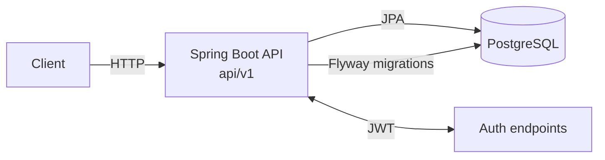

# Blog API

[](https://adoptium.net/)
[](https://spring.io/projects/spring-boot)
[](LICENSE)

REST API for a blog built with Spring Boot (layered controller/service/repository), PostgreSQL + Flyway migrations, and JWT-based authentication.

## Prerequisites

- JDK 17+
- Docker + Docker Compose

## Run

Start Postgres:

```bash
docker compose up -d
```

Run the API (serves under `/api/v1`):

```bash
./mvnw spring-boot:run
```

If `./mvnw` is not executable:

```bash
chmod +x mvnw
```

## Test

### Bruno (API client)

There is a Bruno collection checked into the repo at `docs/bruno/`.

- Open Bruno
- Import/open the collection folder: `docs/bruno/`
- Set variables used by requests:
  - `baseUrl` (example: `http://localhost:8080`)
  - `token` (from `POST /api/v1/auth/login`, required for admin endpoints)
  - `authorId` (required to create articles; see `docs/bruno/README.md`)

To create an **admin** user for testing (so you can call POST/PATCH/DELETE endpoints), set these env vars before starting the API:

- `APP_ADMIN_USERNAME`
- `APP_ADMIN_EMAIL`
- `APP_ADMIN_PASSWORD`

If you don't set any `APP_ADMIN_*` env vars, the API will seed a default admin user on startup:

- username: `admin`
- email: `admin@example.com`
- password: `admin`

### OpenAPI / Swagger UI

This project uses Springdoc.

- Swagger UI: `http://localhost:8080/api/v1/swagger-ui/index.html`
- OpenAPI JSON: `http://localhost:8080/api/v1/v3/api-docs`

Unit tests:

```bash
./mvnw test
```

Integration tests (`*IT.java`, may require Docker):

```bash
./mvnw verify
```

## Diagram



## License

MIT — see [LICENSE](LICENSE).
