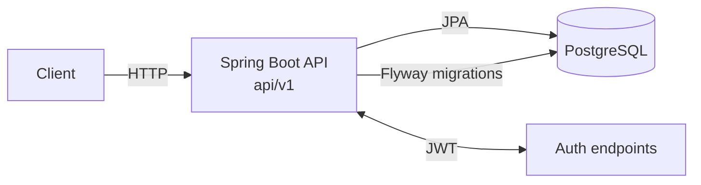

# Blog API

[]()
[]()
[]()

REST API for a blog built with Spring Boot (layered controller/service/repository), PostgreSQL + Flyway migrations, and JWT-based authentication.

## Prerequisites

- JDK 17+
- Docker + Docker Compose

## Run

Start Postgres:

```bash
docker compose up -d
```

Run the API (serves under `/api/v1`):

```bash
./mvnw spring-boot:run
```

If `./mvnw` is not executable:

```bash
chmod +x mvnw
```

## Test

Unit tests:

```bash
./mvnw test
```

Integration tests (`*IT.java`, may require Docker):

```bash
./mvnw verify
```

## Diagram



## License

MIT — see [LICENSE](LICENSE).
